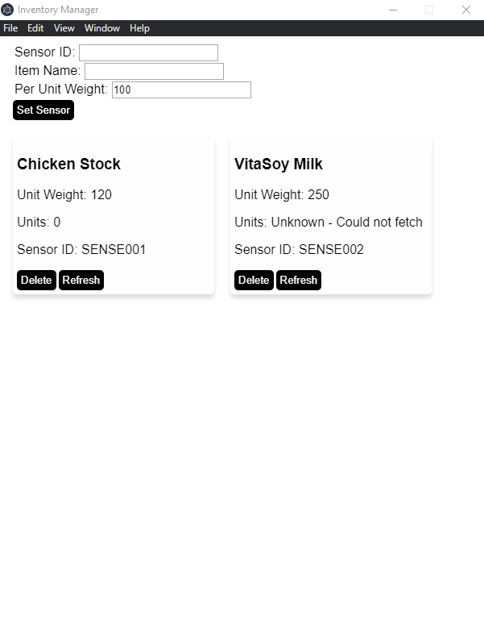

#PF Coursework 1 - Inventory Management
##Overview
The project allows users to conveniently take stock of wares in their warehouses / stores by means of measuring the weights of shelves belonging
to a class of items and using the weights to calculate the amount of stock left over.

Each class of items can be allocated a sensor have the sensor calibrated to the weights of those items.

This project is only a Proof-of-concept and represents the minimum

##Components
1. **Main desktop application** - The desktop application was built in [NodeJS](https://nodejs.org/en/) and uses the [ElectronJS](https://www.electronjs.org/) framework.
Communicates with the remote sensors for getting weight information.

2. **MQTT Broker** - The test MQTT broker (test.mosquitto.org) was used to send messages to and from the application and sensors.

3. **Load Cell Sensor + Raspberry Pi Zero** - A single TAL220 Load cell connected to a Raspberry Pi Zero was used as the weight sensor

##Set Up
### Load Cell Setup
**Step 1:** Run command python3 script ```calibration_simple.py``` on the Raspberry Pi.
```
$ python3 calibration_simple.py
```
This should begin the calibration sequence

**Step 2:** Perform the calibration.
```
$ python3 calibration_simple.py
What's the weight? 100
What's the weight? 1000
What's the weight? -1
waiting
waiting
waiting
...
```
Currently the sensor only takes 2 weights for calibration. Key in the appropriate weights after loading the load cell with known weight.
Key in '-1' on the 3rd weight request to complete calibration sequence. Once the calibration is complete the sensor begins waiting for
probe requests from the desktop application.

**Step 3:** Set up application
1. Install the [NodeJS](https://nodejs.org/en/) if not already installed. Use the recommended ```.msi```. On completion of this step, the NodeJS and Node Package Manager (NPM)
will be installed.
2. Run ```npm install``` in the root directory of the project to install any missing dependencies.
3. Run ```npm start``` to run the application.

##Application Usage


On load, the application will already have 2 sensors loaded in. SENSE001 is the ID of the sensor used. SENSE002 does not exist and is meant to show the extensibility of the project.
The UI has a field for setting sensor mappings, as well as display cards to read the readings from the sensors.

###Mapping a sensor to an item class
On the top of the screen, key in the Sensor ID, Name and Per Unit Weight of the item class to measure, then click the 'Set Sensor' button to confirm.
If the sensor was already mapped to another item, the old mapping is replaced. Otherwise, a new card with the new mapping is displayed.

###Refreshing Readings
Due to test MQTT broker restrictions, this project requires a manual request to the sensors to prevent spamming of the test broker. Hitting the refresh button for each sensor prompts
a reading request from the sensor. Ideally, the sensor provides readings unprompted in a production scenario at a reasonable sample rate.

###Persistence
The sensor data is not stored, only the sensor mappings.

##Notes
The project directory also contains the pi python script [calibration_simple.py](./calibration_simple.py) for reference, though not used by the application.